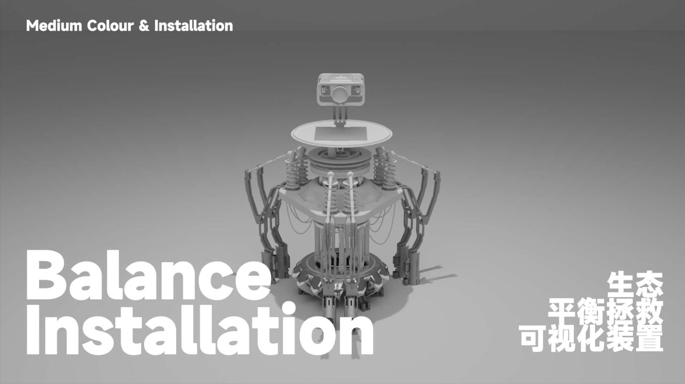

# 生态平衡交互装置项目

- 详细文档请见[平衡装置 Balance Installation](https://alienho.github.io/BalanceInstallation/default-topic.html#2d5ba484_41).

## 项目概述
- 这个项目旨在创建一个生态平衡主题的数字媒体艺术交互装置。
- 装置通过Leap Motion手势控制技术，让用户亲身体验和理解生态平衡的脆弱性和重要性。
- 这个装置不仅是艺术创作的一部分，也是一种教育工具，通过互动体验提高公众对生态保护的认识。

## 功能特点
- **交互控制**：使用Leap Motion手势控制技术进行互动。
- **平衡模拟**：通过控制装置来体验打破和恢复生态平衡的过程。
- **轨迹记录**：记录用户与装置互动的轨迹，并通过可视化展示。
- **教育价值**：提供生态保护的直观教育体验。

## 安装指南
1. 确保您有所有必要的硬件组件，包括Leap Motion传感器、平衡板等。
2. 按照提供的设计图纸和指南组装装置。
3. 安装所需的软件依赖项

## 使用说明
要开始使用装置，请遵循以下步骤：
1. 启动装置并校准Leap Motion传感器。
2. 按照屏幕上的指示进行手势控制。
3. 体验和探索不同的互动模式。

## Test
This is a test case.
